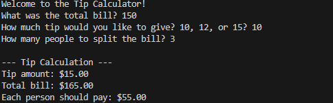
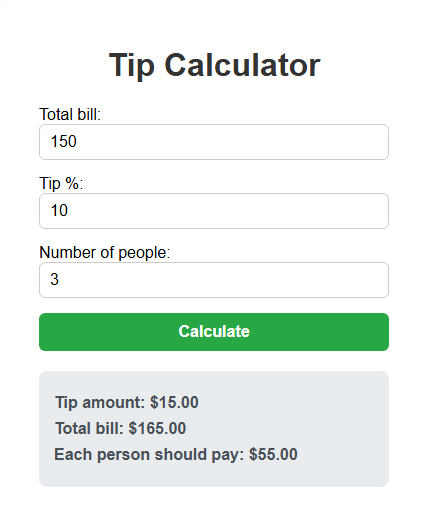
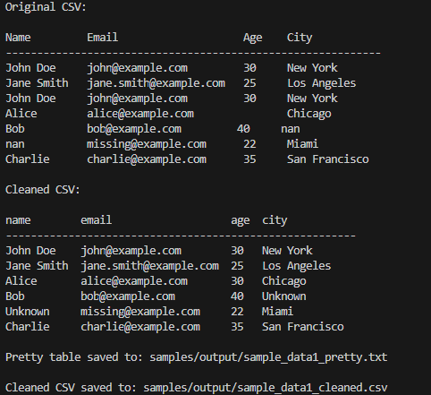
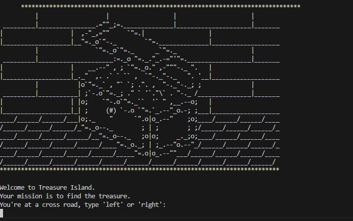

# Python Automation & Tools


A professional collection of **Python scripts and small tools** for automation, data processing, text handling, and interactive utilities.
Designed for **freelancers, startups, and businesses** looking to automate repetitive tasks or showcase practical Python projects.

**GitHub Repository:** [https://github.com/Johan1974/python-automation-and-tools](https://github.com/Johan1974/python-automation-and-tools)

---

## 🎨 Featured Projects

Explore the main projects with usage examples and visual previews:

| Project                 | Preview                                                                                                               | Example Usage                                                      | Description                                                                                                                   |
| ----------------------- | --------------------------------------------------------------------------------------------------------------------- | ------------------------------------------------------------------ | ----------------------------------------------------------------------------------------------------------------------------- |
| **Tip Calculator**      |   | `python tip_calculator/calculator.py`                              | CLI and web (Flask) tool to calculate tips, total bills, and per-person splits with locale-aware input.                       |
| **Band Name Generator** |                                                     | `python band-name-generator/band_name_generator.py`                | Interactive console tool generating creative names for bands, businesses, or projects. Ideal for branding.                    |
| **CSV Cleaner**         |                                                            | `python csv-cleaner/src/cleaner.py --in samples/input/example.csv` | CLI utility to clean, normalize, and prettify CSV files. Remove duplicates, fill missing values, and generate ASCII previews. |
| **Treasure Island**     |                                                    | `python treasure_island/treasure.py`                               | Text-based adventure game with multiple story paths, conditional logic, and ASCII art. Great for learning Python basics.      |

---

## 💡 Use Cases

* Automate repetitive tasks: calculations, file/text processing
* Generate creative ideas with interactive tools like name generators
* Clean and preprocess data for analytics and reporting
* Learn Python basics through interactive games
* Rapid prototyping for workshops, internal processes, or events

---

## 🚀 Why Choose These Tools

* **Ready-to-use:** Functional scripts out-of-the-box
* **Portfolio-ready:** Demonstrates practical Python skills for clients and employers
* **Customizable:** Easily extendable for specific workflows or business needs
* **Market-focused:** Designed with real-world tasks and freelance demand in mind

---

## 🛠 Installation & Usage

Clone the repository:

```bash
git clone https://github.com/Johan1974/python-automation-and-tools.git
cd python-automation-and-tools
```

Each project has its own usage instructions in its folder:

* **Tip Calculator:** CLI and Flask web app (`tip_calculator/`)
* **Band Name Generator:** Interactive console tool (`band-name-generator/`)
* **CSV Cleaner:** CLI for CSV preprocessing (`csv-cleaner/`)
* **Treasure Island:** Text-based adventure game (`treasure_island/`)

### Example Commands

**Tip Calculator CLI**:

```bash
python tip_calculator/calculator.py
# Enter total bill, tip %, number of people
# Output shows tip, total, per-person splits
```

**Band Name Generator**:

```bash
python band-name-generator/band_name_generator.py
# Enter your city and pet's name
# Generates a creative band name
```

**CSV Cleaner**:

```bash
python csv-cleaner/src/cleaner.py --in samples/input/example.csv
# Cleans CSV and outputs formatted version with integer numeric columns
```

**Treasure Island**:

```bash
python treasure_island/treasure.py
# Follow interactive prompts to find the treasure
```

---

## 🧪 CI & Testing

* Each project includes a **dedicated CI workflow** for automated testing
* Unit and integration tests ensure reliable functionality
* Test badges are included in individual project READMEs

---

## 📬 Contact & Freelance

Looking for **custom Python automation, data tools, or web utilities**?

I build:

* Python CLI and web tools
* Workflow automation
* Custom data preprocessing and CSV/Excel utilities
* Interactive or educational Python games

Reach out via GitHub: **[https://github.com/Johan1974](https://github.com/Johan1974)**

---

## 📝 License

MIT License — free to use, modify, and distribute
