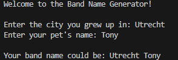

# Band Name Generator – Interactive Python Naming Tool


**Band Name Generator** is a Python tool that instantly generates unique and creative names for bands, businesses, or projects.  
It provides a fast and interactive way to brainstorm memorable and catchy names for any purpose.

**GitHub Repository:**  
https://github.com/Johan1974/python-automation-and-tools/tree/main/band-name-generator

---

## 📸 Screenshot

Below is an example of the interactive console experience:



---

## 🎮 Features

- Generates creative names for bands, businesses, or projects  
- Simple and intuitive interactive console interface  
- Clean input handling for reliable results  
- Lightweight Python script focused on clarity and usability  
- Easy to extend with additional logic or naming rules  

---

## 🚀 Installation & Usage

1. Clone the repository:
```bash
git clone https://github.com/Johan1974/python-automation-and-tools.git
cd python-automation-and-tools/band-name-generator
````

2. Run the script:

```bash
python band_name_generator.py
```

3. Follow the prompts to generate name ideas instantly.

---

## 💡 Applications & Use Cases

* Brainstorm unique and memorable names for bands, companies, or creative projects
* Support branding and marketing efforts with fast name generation
* Educational example of Python fundamentals and clean function design
* Portfolio-ready mini project demonstrating interactive Python tooling

---

## 🔑 Key Benefits

* Fast and reliable name generation
* Clean, readable, and testable Python code
* CI-backed core logic for confidence and professionalism
* Ideal example for freelance clients seeking simple but polished tools

---

## ⚠️ Notes

* Unit tests and CI workflows validate the core name-generation logic
* Designed to be **simple by default**, extensible when needed
* Advanced features can be added for client-specific or commercial use

---

## 📬 Contact & Freelance

Looking for a **custom Python naming tool**, branding helper, or interactive script?
Reach out via GitHub for **freelance development or tailored solutions**.

---

## 📝 License

MIT License — free to use, modify, and distribute
