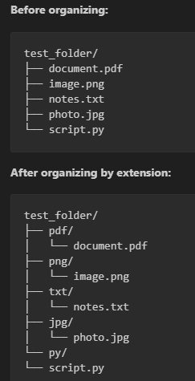

# Python Auto File Organizer 🗂️🐍 — Automatic Folder Sorting CLI


**Python Auto File Organizer** is a lightweight CLI tool to **automatically organize files** by **extension** or **modification date**, keeping folders tidy and clutter-free.

**GitHub Repository:** [Python Automation & Tools — Auto File Organizer](https://github.com/Johan1974/python-automation-and-tools/tree/main/python-auto-file-organizer)

---

## 📸 Screenshot / Preview

**Original folder (`test_folder/`):**

```

document.pdf
image.png
notes.txt
photo.jpg
script.py

```

**Organized by extension:**

```

jpg/
└── photo.jpg
pdf/
└── document.pdf
png/
└── image.png
py/
└── script.py
txt/
└── notes.txt

```

**Organized by date (`YYYY-MM-DD` folders):**

```

2026-01-02/
├── document.pdf
├── image.png
├── notes.txt
├── photo.jpg
└── script.py

````



---

## 💡 Key Benefits

* ✅ Save time — automate folder cleanup
* ✅ Reduce clutter — organize large folders quickly
* ✅ Flexible sorting — by **file type** or **last modification date**
* ✅ Safe handling — avoids overwriting files
* ✅ Dry-run mode — preview changes before applying
* ✅ Reset test folders — restore initial state
* ✅ Undo last cleanup
* ✅ Cross-platform — Windows, macOS, Linux

---

## 🎮 Features

* Organize by **file extension** (`.pdf`, `.jpg`, `.txt`, etc.)
* Organize by **modification date** (`YYYY-MM-DD`)
* **Dry-run mode** to preview changes
* **Reset function** to restore original test folder
* **Undo last cleanup**
* **Safe file moves** with automatic renaming to prevent conflicts
* Lightweight CLI with optional **CI integration** for automated testing

---

## 🛠 Requirements

* Python 3.8+
* No additional packages required

---

## 🚀 Installation

```bash
git clone https://github.com/Johan1974/python-automation-and-tools.git
cd python-automation-and-tools/python-auto-file-organizer
````

---

## Usage Examples

### 🔹 Preview Changes (Dry-Run)

```bash
python3 auto_cleanup.py -s test_folder --mode extension --dry-run
```

### 📂 Organize by File Type (Extension)

```bash
python3 auto_cleanup.py -s test_folder --mode extension
```

### 📅 Organize by Modification Date

```bash
python3 auto_cleanup.py -s test_folder --mode date
```

### 🔄 Reset Test Folder

```bash
python3 auto_cleanup.py -s test_folder --reset
```

### ↩️ Undo Last Cleanup

```bash
python3 auto_cleanup.py -s test_folder --undo
```

---

## 🧪 Running Tests Locally

```bash
python3 auto_cleanup.py -s test_folder --mode extension --dry-run
python3 auto_cleanup.py -s test_folder --mode date --dry-run
python3 auto_cleanup.py -s test_folder --reset
python3 auto_cleanup.py -s test_folder --undo --dry-run
```

---

## ⚙️ CI/CD Pipeline

GitHub Actions automatically tests:

* Organizing by extension
* Organizing by date
* Resetting test folder
* Undo operations
* Temporary folder validation

Workflow file: `.github/workflows/python_auto_file_organizer_ci.yml`

---

## 🤝 Contributing

Enhancements, bug fixes, and feature requests are welcome:

1. Fork the repository
2. Create a feature branch
3. Submit a pull request

All PRs are validated automatically via CI.

---

## 📅 Roadmap

* Nested folder sorting
* Custom folder naming rules
* Logging and reporting of file moves
* Optional GUI interface
* Web-based Flask/FastAPI version
* Publish to PyPI (`pip install auto-file-organizer`)

---

## 📬 Freelance & Custom Automation

I build **custom file automation tools, CLI utilities, and workflow scripts**.
Contact via GitHub: **[https://github.com/Johan1974](https://github.com/Johan1974)**

---

## 📝 License

MIT License — free to use, modify, and distribute
